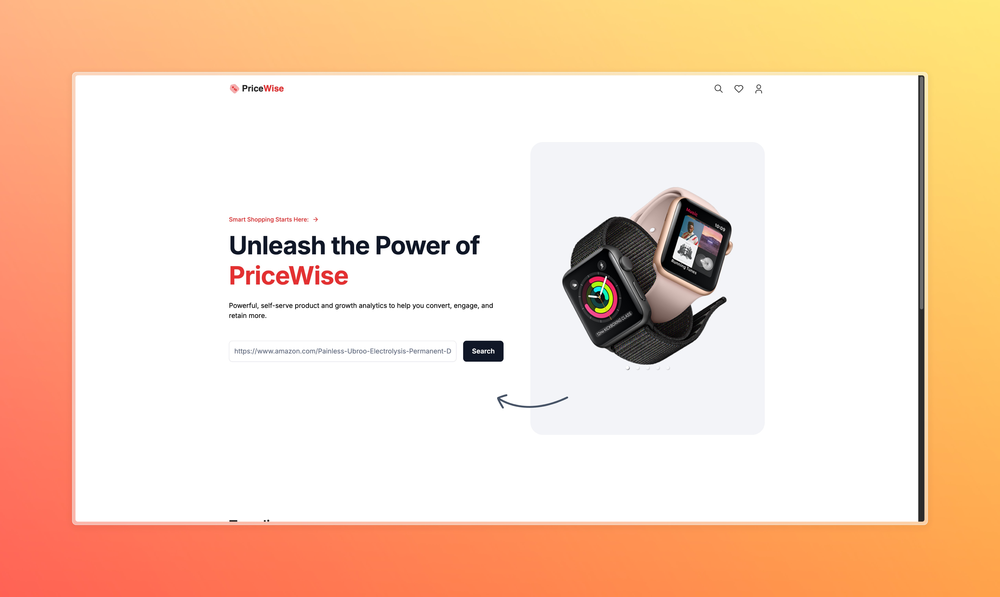
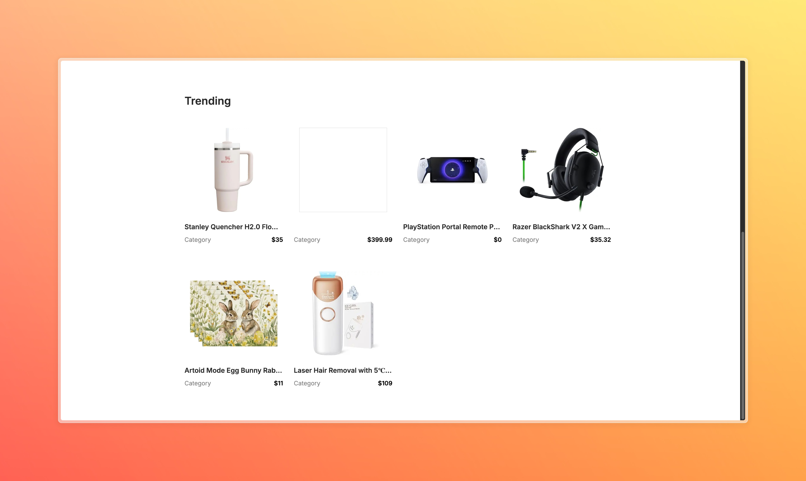

# 💰 Price Tracking Application (UI/UX)





## Overview
This project is a price tracking application inspired by and based on teachings from [JavaScript Mastery](https://www.youtube.com/@javascriptmastery/videos). Special thanks to Adrian Hajdin and the JavaScript Mastery team for their excellent educational content and inspiration.

## Features
- Product price tracking across e-commerce platforms
- Email notifications for price changes
- Automated web scraping
- Responsive modern UI
- Real-time price updates
- Detailed product analytics

## Tech Stack
- Next.js 14
- TypeScript
- MongoDB
- Tailwind CSS
- Bright Data Web Scraping
- Nodemailer
- Mongoose
- Cheerio

## Getting Started

### Prerequisites
- Node.js (v18 or higher)
- MongoDB database
- Bright Data account
- Email service account

### Environment Variables
Create a `.env` file in the root directory with the following variables:
```bash
env
MONGODB_URI=
BRIGHT_DATA_USERNAME=
BRIGHT_DATA_PASSWORD=
EMAIL_USER=
EMAIL_PASS=
```

### Installation
1. Clone the repository
```bash
bash
git clone https://github.com/pakagronglebel/price-tracking-app.git
```

2. Install dependencies
```bash
npm install
# or
yarn install
```

3. Run the development server
```bash
npm run dev
# or
yarn dev
```

4. Open [http://localhost:3000](http://localhost:3000) in your browser

## Project Structure
```
├── lib/
│   ├── nodemailer/     # Email notification setup
│   ├── scraper/        # Web scraping functionality
│   └── mongoose.ts     # Database connection
├── components/         # React components
├── public/            # Static assets
└── ...
```

## Features in Detail
- **Product Tracking**: Monitor prices across various e-commerce platforms
- **Email Notifications**: Receive alerts when prices drop
- **Automated Scraping**: Regular price checks using Bright Data's infrastructure
- **Responsive Design**: Mobile-first approach for all screen sizes

## Contributing
Contributions are welcome! Please feel free to submit a Pull Request.

## Credits
This project was built following the teachings and inspiration from:
- [JavaScript Mastery YouTube Channel](https://www.youtube.com/@javascriptmastery/videos)
- Adrian Hajdin - JavaScript Mastery

## License
This project is licensed under the MIT License - see the LICENSE file for details.

## Acknowledgments
- [JavaScript Mastery](https://www.jsmastery.pro/) for the excellent tutorials and inspiration
- Bright Data for web scraping infrastructure
- MongoDB for database solutions
- Next.js team for the amazing framework

## Contact
For any queries regarding this project, please open an issue in the repository.

---
*Note: This project is created for educational purposes and is inspired by JavaScript Mastery's teachings.*